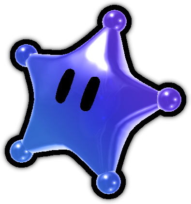

<p align="center">
  
</p>

# Nebula
This is a personal project of mine. The plan is to make it a cross-platform **general-purpose** tool for modding (not just a level editor). 
The reason why this project was even made in the first place was due to the complexity and lack of stable resources for modding (especially for Linux).

Please note: this is not *intended* to be a replacement of any kind for any current tools, rather just a learning opportunity for me to learn Rust and "lower-level" Wii modding (and I guess Godot too). 
I've never made a cross-platform application like this, and I've *especially* never made one that is public.

I only made this project in the hopes that it will make *my* process of modding much easier. However, I open-sourced it with the realization that it could also to do the same for other people
(And also maybe perhaps bring some contributors... please... help)

This is not my first time writing a tool for myself, but it *is* the first time I'm working on one publicly and *definitely* the first time I'm making one this big. 

## Contributing
This will likely not have any contributors but on the off chance you'd like to work on this slide a DM on discord (`@cruglet2`), email me (`cruglet@gmail.com`), or do some github fork/commit/issue shenanigans. 
I'll respond most quickly on Discord or email, though.

Contributing is **very** encouraged, especially when it comes to the backend of some of this stuff. A big thing slowing progress is the **learning** process. 
Not only do I have to create the frontend, but I also have to read other people's code to try and understand how I can even get started. And after that, I have to figure out how to translate it to Rust or GDScript - depending on the task.

## Plans
Right now, I'm focused on getting a product that I'm happy with for NSMBW. Newer integration is *planned*, but for now I'm just focused on getting Vanilla NSMBW at a satisfying spot before I move forward. 
I also need to gauge how difficult it'd be to integrate Newer as an alternative, since a **lot** of it is custom.

In addition, I've deliberately configured this project in a way that can expand functionality to other games, most likely SMG1 & SMG2; 
this is also the main reason why I chose Godot for my frontend, since I'm already comfortable with it and it already has 3D out of the box (unlike other frameworks I thought about such as Tauri-rust, I am NOT learning OpenGL for potential 3D)

As a stretch goal, I actually had plans to make a **pseudo**-custom programming language using the Kamek (or my own Rust-inspired) backend for custom code integration.
That idea was basically what inspired this project, since creating custom code really sucked and documentation was non-existant, so I wondered: "Hey wouldn't it be nice if you could just do something like:"
```
import NSMBW as Game

let Mario = Game.StageActors.Player1
let POWERUPS = Mario.POWERUPS

fn change_mario_powerup() {
  Mario.powerup = POWERUPS.FIRE
}

game.hook("on_level_load", change_mario_powerup())
```
Now THAT would be a learning opportunity, especially if I went with the Rust rewrite, but I also don't want to work on this until I'm 40. 


Other people are welcome to try and do that if they are interested, for whatever reason.

## Last Thing
If you want to help out with the project, go right ahead. Just don't be a dick with the "omg this code is terrrible!!!!!!!" or "what youre doing is dumb and pointless!!1!!!" 
I wouldn't mind explaining the code if you *do* plan on helping, but don't bother me if you're just gonna complain about something stupid
